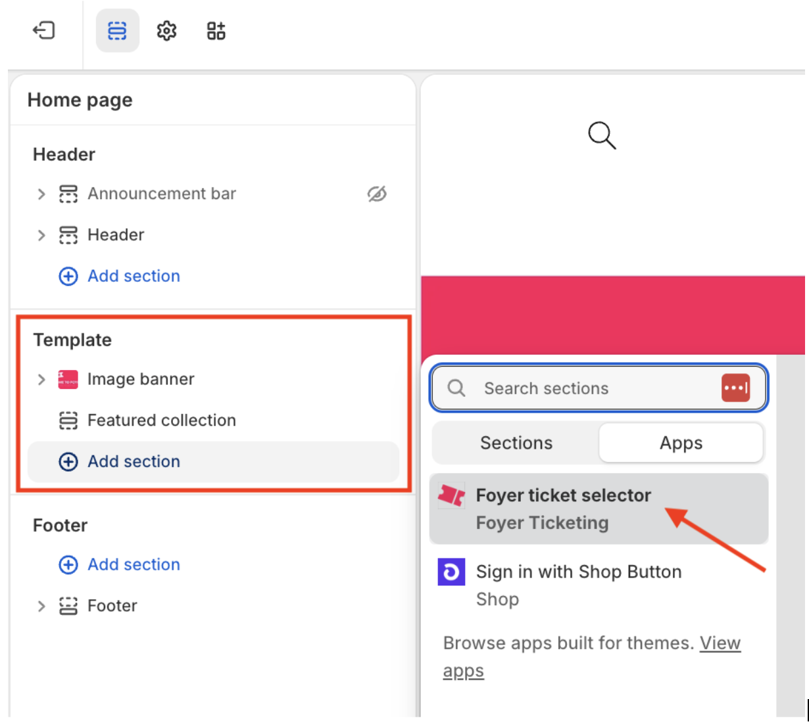

## Set up a product template with the Foyer ticket selector

Before creating a ticket product, Foyer’s ticket selector block needs to be added to a Shopify product template. 

- In your Shopify admin go to the Online Store in the side menu and click the pencil to Edit Theme.
- At the top of the Theme Editor, locate the page selector (it will typically show Home page) and choose Products > Default product.
- In the left-hand page template outline, click Add section.
- In the panel that opens, select the Apps tab.
- Find and select Foyer ticket selector.

The Ticket Selector app block will be added to your product template and you can drag and drop it wherever you want it to appear on the product page.

